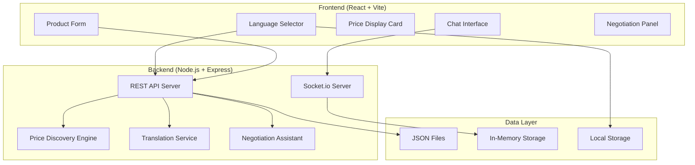

# Design Document: AI Mandi – Multilingual Smart Market Assistant

## Overview

AI Mandi is a full-stack web application that enables multilingual communication between vendors and buyers in local markets. The system provides AI-powered price discovery, real-time chat with translation, and negotiation assistance. The architecture prioritizes simplicity, clean code, and easy deployment suitable for a hackathon prototype.

## Architecture

### High-Level Architecture



### Technology Stack

**Frontend:**
- React 18 with Vite for fast development and building
- Tailwind CSS for utility-first styling
- Socket.io-client for real-time communication
- Functional components with React hooks

**Backend:**
- Node.js with Express.js for REST API
- Socket.io for WebSocket communication
- CORS middleware for cross-origin requests
- JSON file system for data persistence

**Data Storage:**
- JSON files for product data and price history
- In-memory storage for active chat sessions
- Browser local storage for user preferences

## Components and Interfaces

### Frontend Components

#### 1. App Component
- Root component managing global state
- Handles language context and user session
- Coordinates communication between child components

#### 2. LanguageSelector Component
```typescript
interface LanguageOption {
  code: string;
  name: string;
  nativeName: string;
}

interface LanguageSelectorProps {
  selectedLanguage: string;
  onLanguageChange: (language: string) => void;
  languages: LanguageOption[];
}
```

#### 3. ProductForm Component
```typescript
interface Product {
  name: string;
  quantity: number;
  unit: string;
}

interface ProductFormProps {
  onSubmit: (product: Product) => void;
  isLoading: boolean;
}
```

#### 4. PriceCard Component
```typescript
interface PriceData {
  suggestedPrice: number;
  currency: string;
  unit: string;
  confidence: number;
  marketAverage?: number;
}

interface PriceCardProps {
  priceData: PriceData | null;
  productName: string;
}
```

#### 5. ChatInterface Component
```typescript
interface Message {
  id: string;
  sender: string;
  content: string;
  originalContent?: string;
  timestamp: Date;
  translated: boolean;
}

interface ChatInterfaceProps {
  messages: Message[];
  onSendMessage: (content: string) => void;
  currentUser: string;
}
```

#### 6. NegotiationPanel Component
```typescript
interface NegotiationSuggestion {
  type: 'counter_offer' | 'market_info' | 'strategy';
  content: string;
  suggestedPrice?: number;
}

interface NegotiationPanelProps {
  suggestions: NegotiationSuggestion[];
  currentPrice?: number;
  marketPrice?: number;
}
```

### Backend API Endpoints

#### REST API Routes

```typescript
// Product and Price Discovery
POST /api/products/analyze
GET /api/products/price-history/:productName
GET /api/market/average-price/:productName

// Translation
POST /api/translate
GET /api/languages/supported

// Negotiation
POST /api/negotiation/suggest
GET /api/market/trends/:productName
```

#### Socket.io Events

```typescript
// Client to Server
'join_room': { roomId: string, userId: string }
'send_message': { roomId: string, message: string, language: string }
'typing': { roomId: string, userId: string }

// Server to Client
'message_received': { message: Message, translated?: Message }
'user_joined': { userId: string }
'user_left': { userId: string }
'typing_indicator': { userId: string, isTyping: boolean }
```

## Data Models

### Product Model
```typescript
interface Product {
  id: string;
  name: string;
  quantity: number;
  unit: string;
  category?: string;
  submittedAt: Date;
  userId: string;
}
```

### Price Data Model
```typescript
interface PriceEntry {
  productName: string;
  price: number;
  unit: string;
  date: Date;
  source: 'user_input' | 'market_data' | 'ai_suggestion';
  location?: string;
}
```

### Chat Message Model
```typescript
interface ChatMessage {
  id: string;
  roomId: string;
  senderId: string;
  content: string;
  originalLanguage: string;
  translations: Record<string, string>;
  timestamp: Date;
  messageType: 'text' | 'price_offer' | 'system';
}
```

### Translation Model
```typescript
interface TranslationRequest {
  text: string;
  fromLanguage: string;
  toLanguage: string;
}

interface TranslationResponse {
  originalText: string;
  translatedText: string;
  confidence: number;
  fromLanguage: string;
  toLanguage: string;
}
```

## Core Services

### 1. Price Discovery Engine

The Price Discovery Engine uses rule-based logic to suggest fair prices:

```typescript
class PriceDiscoveryEngine {
  private priceDatabase: PriceEntry[];
  
  async suggestPrice(product: Product): Promise<PriceData> {
    // 1. Look up historical prices for similar products
    // 2. Apply seasonal adjustments
    // 3. Consider quantity discounts
    // 4. Return suggestion with confidence score
  }
  
  private calculateBasePrice(productName: string): number {
    // Rule-based pricing using mock data
  }
  
  private applyQuantityDiscount(basePrice: number, quantity: number): number {
    // Bulk pricing logic
  }
}
```

### 2. Translation Service

Mock translation service with predefined translations:

```typescript
class TranslationService {
  private translations: Record<string, Record<string, string>>;
  
  async translate(request: TranslationRequest): Promise<TranslationResponse> {
    // 1. Check if translation exists in mock data
    // 2. Apply simple word substitution for common terms
    // 3. Return original text if translation unavailable
  }
  
  private loadMockTranslations(): void {
    // Load predefined translations for common market terms
  }
}
```

### 3. Negotiation Assistant

AI assistant providing negotiation suggestions:

```typescript
class NegotiationAssistant {
  async generateSuggestions(
    currentPrice: number,
    marketPrice: number,
    chatHistory: ChatMessage[]
  ): Promise<NegotiationSuggestion[]> {
    // 1. Analyze price difference from market average
    // 2. Consider negotiation history
    // 3. Generate contextual suggestions
  }
  
  private analyzeNegotiationContext(messages: ChatMessage[]): NegotiationContext {
    // Extract price mentions and negotiation patterns
  }
}
```

## File Structure

```
ai-mandi/
├── frontend/
│   ├── src/
│   │   ├── components/
│   │   │   ├── LanguageSelector.jsx
│   │   │   ├── ProductForm.jsx
│   │   │   ├── PriceCard.jsx
│   │   │   ├── ChatInterface.jsx
│   │   │   └── NegotiationPanel.jsx
│   │   ├── hooks/
│   │   │   ├── useSocket.js
│   │   │   ├── useLanguage.js
│   │   │   └── useLocalStorage.js
│   │   ├── services/
│   │   │   ├── api.js
│   │   │   └── socket.js
│   │   ├── utils/
│   │   │   ├── translations.js
│   │   │   └── constants.js
│   │   ├── App.jsx
│   │   └── main.jsx
│   ├── package.json
│   └── vite.config.js
├── backend/
│   ├── src/
│   │   ├── routes/
│   │   │   ├── products.js
│   │   │   ├── translation.js
│   │   │   └── negotiation.js
│   │   ├── services/
│   │   │   ├── priceDiscovery.js
│   │   │   ├── translation.js
│   │   │   └── negotiation.js
│   │   ├── data/
│   │   │   ├── products.json
│   │   │   ├── prices.json
│   │   │   └── translations.json
│   │   ├── middleware/
│   │   │   └── cors.js
│   │   ├── socket/
│   │   │   └── chatHandler.js
│   │   └── server.js
│   └── package.json
├── README.md
└── .env.example
```

## Correctness Properties

*A property is a characteristic or behavior that should hold true across all valid executions of a system—essentially, a formal statement about what the system should do. Properties serve as the bridge between human-readable specifications and machine-verifiable correctness guarantees.*

### Property 1: Language Selection Persistence
*For any* valid language selection, storing the language choice should result in the same language being retrievable from local storage and restored on application restart.
**Validates: Requirements 1.2, 1.4, 9.1**

### Property 2: UI Language Consistency
*For any* selected language, all UI labels should be updated to display in that language consistently across all components.
**Validates: Requirements 1.3**

### Property 3: Form Validation Behavior
*For any* product form submission, the system should validate required fields, display appropriate error messages for invalid inputs, and successfully submit valid data to the backend.
**Validates: Requirements 2.2, 2.3, 2.4**

### Property 4: Price Discovery Response
*For any* valid product submission, the price discovery engine should calculate and return a suggested price that is properly formatted in Indian Rupees with appropriate units.
**Validates: Requirements 3.1, 3.2, 3.4**

### Property 5: Real-time Message Transmission
*For any* message sent through the chat system, it should be transmitted via Socket.io and displayed immediately in the recipient's chat window.
**Validates: Requirements 4.2, 4.3**

### Property 6: Translation Service Behavior
*For any* message sent between users with different language preferences, the translation service should detect the sender's language, translate the message, and display both original and translated text.
**Validates: Requirements 5.1, 5.2, 5.3**

### Property 7: Translation Fallback Handling
*For any* message that cannot be translated, the system should display the original message with a clear indicator that translation is unavailable.
**Validates: Requirements 5.4**

### Property 8: Negotiation Suggestions Generation
*For any* price mention in chat, the negotiation assistant should provide relevant counter-offer suggestions with proper formatting and reasoning.
**Validates: Requirements 6.2, 6.3**

### Property 9: Market Data Integration
*For any* negotiation suggestion when market data is available, the assistant should reference average market prices in its recommendations.
**Validates: Requirements 6.4**

### Property 10: Dashboard Reactivity
*For any* section update in the dashboard, the changes should be reflected in the UI without requiring a page refresh.
**Validates: Requirements 7.5**

### Property 11: Error Handling Consistency
*For any* error condition encountered by the system, it should handle the error gracefully and display appropriate user-friendly messages.
**Validates: Requirements 8.4**

### Property 12: Data Persistence Consistency
*For any* data stored by the system, it should maintain consistency across browser sessions and be retrievable when needed.
**Validates: Requirements 9.5**

## Error Handling

### Frontend Error Handling
- **Network Errors**: Display user-friendly messages when API calls fail
- **Validation Errors**: Show inline validation messages for form fields
- **Socket Connection Errors**: Gracefully handle disconnections and attempt reconnection
- **Translation Errors**: Fall back to original text when translation fails

### Backend Error Handling
- **Invalid Input**: Return structured error responses with clear messages
- **File System Errors**: Handle JSON file read/write failures gracefully
- **Socket Errors**: Log errors and maintain connection stability
- **Service Unavailable**: Provide fallback responses when services are down

### Error Response Format
```typescript
interface ErrorResponse {
  success: false;
  error: {
    code: string;
    message: string;
    details?: any;
  };
}
```

## Testing Strategy

### Dual Testing Approach
The application will use both unit testing and property-based testing for comprehensive coverage:

**Unit Tests:**
- Test specific examples and edge cases
- Validate component rendering and user interactions
- Test API endpoint responses with known inputs
- Verify error conditions and boundary cases

**Property-Based Tests:**
- Validate universal properties across all inputs
- Test form validation with randomly generated data
- Verify translation behavior with various language combinations
- Test price discovery with different product inputs

### Property-Based Testing Configuration
- **Library**: Use `fast-check` for JavaScript property-based testing
- **Iterations**: Minimum 100 iterations per property test
- **Test Tags**: Each property test must reference its design document property
- **Tag Format**: `// Feature: ai-mandi, Property {number}: {property_text}`

### Testing Framework Setup
- **Frontend**: Vitest with React Testing Library
- **Backend**: Jest with Supertest for API testing
- **Integration**: Socket.io testing with mock clients
- **Property Tests**: fast-check integrated with Jest/Vitest

### Test Coverage Requirements
- Minimum 80% code coverage for core functionality
- All correctness properties must have corresponding property-based tests
- Critical user flows must have integration tests
- Error handling paths must be tested with unit tests

### Mock Data Strategy
- Use consistent mock datasets for price discovery testing
- Provide sample translations for all supported languages
- Create realistic product data for form testing
- Generate varied chat scenarios for translation testing