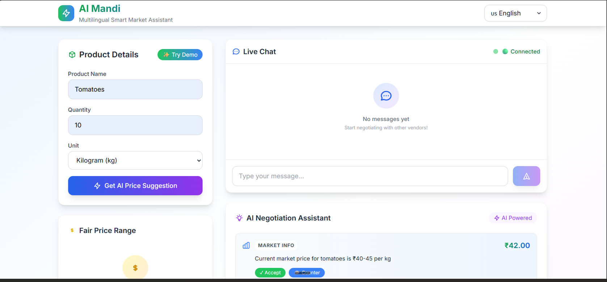
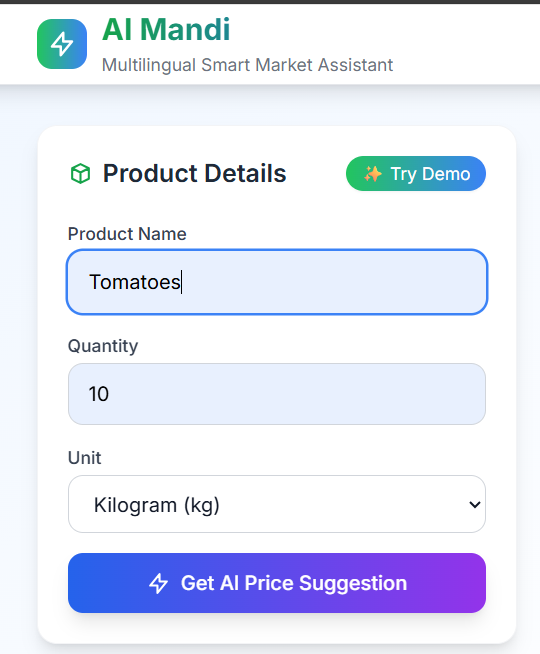
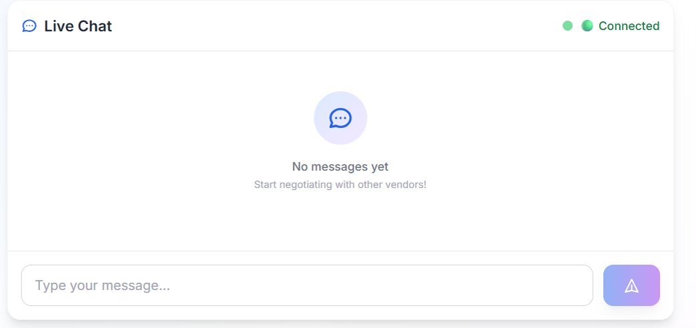
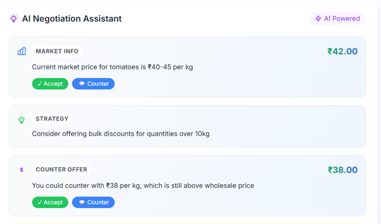

# 🚀 AI Mandi - Multilingual Smart Market Assistant

> **Hackathon MVP** - Built with Kiro AI for seamless development

## 🎯 Problem Statement

Local vendors and buyers in Indian markets face significant communication barriers due to language differences, lack of fair price discovery mechanisms, and inefficient negotiation processes. This leads to:

- **Language barriers** preventing effective communication
- **Price uncertainty** causing unfair deals
- **Inefficient negotiations** wasting time and opportunities
- **Limited market access** for vendors speaking different languages

## 💡 Solution

AI Mandi is a **real-time multilingual market assistant** that bridges communication gaps and empowers fair trade through:

- 🌐 **Real-time translation** across 4 Indian languages
- 🤖 **AI-powered price discovery** for fair market pricing
- 💬 **Smart negotiation assistance** with contextual suggestions
- 📱 **Modern, responsive interface** for seamless user experience

## ✨ Key Features

### 🗣️ Multilingual Communication
- **4 Languages Supported**: English, Hindi, Malayalam, Tamil
- **Real-time Translation**: Automatic message translation in chat
- **Language Persistence**: Remembers user language preference
- **Native Script Support**: Proper display of regional languages

### 💰 AI Price Discovery
- **Smart Pricing Engine**: Rule-based price suggestions
- **Market Data Integration**: Confidence scores and market averages
- **Multiple Units Support**: kg, pieces, liters, grams, dozen, bundles
- **Visual Price Cards**: Beautiful, informative price displays

### 🤝 Negotiation Assistant
- **AI-Powered Suggestions**: Context-aware negotiation advice
- **Market Intelligence**: Real-time market data integration
- **Strategy Recommendations**: Counter-offer suggestions
- **Interactive Cards**: Accept/Counter buttons for quick actions

### 💬 Real-time Chat System
- **WebSocket Communication**: Instant message delivery
- **Connection Status**: Visual connection indicators
- **Typing Indicators**: Real-time typing feedback
- **Message History**: Persistent chat sessions

## 🛠️ Tech Stack

### Frontend
- **React 18** - Modern UI framework
- **Vite** - Lightning-fast build tool
- **Tailwind CSS** - Utility-first styling
- **Socket.io Client** - Real-time communication

### Backend
- **Node.js** - JavaScript runtime
- **Express.js** - Web application framework
- **Socket.io** - WebSocket server
- **JSON Storage** - Lightweight data persistence

### Architecture
```
┌─────────────────┐    ┌─────────────────┐    ┌─────────────────┐
│   React App     │    │  Express API    │    │  JSON Storage   │
│                 │    │                 │    │                 │
│ • Components    │◄──►│ • REST Routes   │◄──►│ • Products      │
│ • Hooks         │    │ • Socket.io     │    │ • Prices        │
│ • Translations  │    │ • Services      │    │ • Translations  │
└─────────────────┘    └─────────────────┘    └─────────────────┘
```

## 🚀 Quick Start

### Prerequisites
- Node.js 16+ installed
- npm or yarn package manager

### ⚡ Super Quick Start (Recommended)

**Windows:**
```bash
# Clone and run in one command
git clone <repository-url>
cd ai-mandi
quick-start.bat
```

**Mac/Linux:**
```bash
# Clone and run in one command
git clone <repository-url>
cd ai-mandi
chmod +x quick-start.sh
./quick-start.sh
```

### 📋 Manual Setup

1. **Clone the repository**
   ```bash
   git clone <repository-url>
   cd ai-mandi
   ```

2. **Install dependencies**
   ```bash
   npm run install:all
   ```

3. **Start the application**
   ```bash
   npm run dev
   ```

4. **Access the application**
   - Frontend: http://localhost:5173
   - Backend API: http://localhost:3001
   - Health Check: http://localhost:3001/health

## 📱 Demo Steps (1-Minute Demo)

### 🎯 **Quick Demo Flow**

1. **🌐 Language Selection** (10 seconds)
   - Click language dropdown in top-right
   - Select Hindi/Malayalam/Tamil
   - Notice instant UI translation

2. **💰 AI Price Discovery** (20 seconds)
   - Click "✨ Try Demo" button (auto-fills: Tomatoes, 10kg)
   - Click "Get AI Price Suggestion"
   - View beautiful price card with confidence score

3. **💬 Real-time Chat** (20 seconds)
   - Check connection status (🟢 Connected)
   - Type: "I want to buy tomatoes for ₹35/kg"
   - See instant message delivery and typing indicators

4. **🤖 AI Negotiation** (10 seconds)
   - View AI-powered suggestions in bottom panel
   - See market data and counter-offer recommendations
   - Click "Accept" or "Counter" buttons

### 🎪 **Judge-Friendly Features**
- **Instant Setup**: One command to run everything
- **Visual Polish**: Modern gradients, animations, icons
- **Real-time Demo**: Live WebSocket connections
- **Multilingual**: 4 Indian languages with proper scripts
- **AI Intelligence**: Smart price discovery and negotiation

## 📊 Screenshots

*[Placeholder for screenshots - Add actual screenshots here]*

### Dashboard Overview


### Price Discovery


### Chat Interface


### Negotiation Assistant


## 🏗️ Project Structure

```
ai-mandi/
├── frontend/                 # React frontend application
│   ├── src/
│   │   ├── components/      # React components
│   │   ├── hooks/          # Custom React hooks
│   │   ├── services/       # API services
│   │   ├── utils/          # Utility functions
│   │   └── App.jsx         # Main application component
│   ├── package.json
│   └── vite.config.js
├── backend/                 # Node.js backend application
│   ├── src/
│   │   ├── routes/         # API route handlers
│   │   ├── services/       # Business logic services
│   │   ├── socket/         # Socket.io handlers
│   │   ├── middleware/     # Express middleware
│   │   ├── utils/          # Utility functions
│   │   └── server.js       # Main server file
│   └── package.json
├── .kiro/                  # Kiro AI specifications
│   └── specs/
│       └── ai-mandi/       # Project specifications
├── package.json            # Root package.json
└── README.md              # This file
```

## 🧪 Testing

### Run Tests
```bash
# Backend tests
cd backend
npm test

# Frontend tests
cd frontend
npm test
```

### Test Coverage
- Unit tests for core functionality
- Integration tests for API endpoints
- Socket.io connection testing
- Property-based testing for validation

## 🔧 Configuration

### Environment Variables

**Backend (.env)**
```env
PORT=3001
FRONTEND_URL=http://localhost:5173
NODE_ENV=development
```

**Frontend (.env)**
```env
VITE_API_URL=http://localhost:3001
VITE_SOCKET_URL=http://localhost:3001
```

## 🚀 Deployment

### Production Build
```bash
# Build frontend
cd frontend
npm run build

# Start production server
cd ../backend
npm start
```

### Docker Support (Optional)
```dockerfile
# Dockerfile example for containerization
FROM node:18-alpine
WORKDIR /app
COPY package*.json ./
RUN npm install
COPY . .
EXPOSE 3001
CMD ["npm", "start"]
```

## 🤝 Contributing

This is a hackathon prototype built for demonstration purposes. For improvements:

1. Fork the repository
2. Create a feature branch
3. Make your changes
4. Submit a pull request

## 📄 License

MIT License - see LICENSE file for details

## 🙏 Acknowledgments

- **Kiro AI** - For providing the development platform that made rapid prototyping possible
- **Hackathon Organizers** - For the opportunity to build innovative solutions
- **Open Source Community** - For the amazing tools and libraries used

## 📞 Support

For questions or support:
- Create an issue in the repository
- Contact the development team
- Check the documentation in `.kiro/specs/`

---

**Built with ❤️ using Kiro AI** | **Hackathon Ready** | **Production Scalable**
